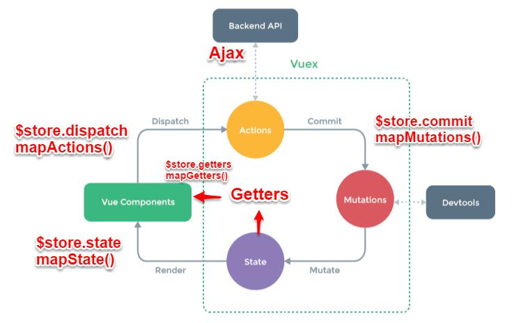

# Ecommerce Website

**Table Of Contents**
- [Project description](#project-description)
- [System design](#project-description)
- [Swagger](#installation)
- [Installation](#installation)
- [Usage](#example-usage)
- [License](#license)

## Project description:
This is an ecommerce website that i'm building in order for me to develop my skills and apply some of the best practices that'ive learned such ass TDD, scrumwise and SOLID.
It's built using vuejs for the ui, spring boot for the server and mysql as a db.


*Techs:*
* spring boot
* spring mvc
* spring data
* spring test
* vuejs
* vuex
* vue bootsrap
* mysql
* swagger

## Functional and Non Functional Requirements


## System Design
**Server**


**Front States**



## Swagger


## Installation

**Requirements/Dependencies if not using docker:**
- mysql
- java sdk
- gradle
- nodejs


## Example Usage

**Usage with Docker**
Download or clone the project then
```
$ cd /ecommerce
$ docker compose up
```
**Usage W/o Docker**
In this setup you'll need to open two <br>
Download or clone the project then run the following cmds in the first <br>
```
$ cd /ecommerce/server
$ gradle bootRun
```
and the following in the second
```
$ cd /ecommerce/application
$ npm run serve
```

## todo (server side)
* add sonarqube and better logging
* add caching using redis and spring cache
* add the search functionality using elasticsearch  
* deploy on cloud foundry

## Contributing
feel free to fork and contribute. 

## Support
If you have any questions you can contact the author. Contact Information is provided at the end of this document. If you find any issues or bugs, create a new issue and make a pull request to fix it!


## License

